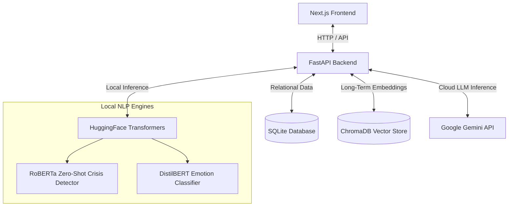

# MindMate: A Warm, Empathetic AI Companion for Mental Well-being

> **"مايند ميت: الصاحب اللي دايمًا سامعك، بيفهم مشاعرك ويساعدك تتابع عاداتك."**  
> *(MindMate: The friend who's always listening, understanding your emotions, and helping you track your habits.)*

---

## Inspiration

Traditional mental health and habit-tracking apps often feel clinical, cold, and rigid. They expect users to fill out spreadsheets of numbers, check arbitrary input boxes, and read standardized medical advice. For someone struggling with stress, anxiety, or loneliness, these interfaces can feel more like a chore than a safe space. 

Furthermore, general-purpose LLM assistants lack cultural nuance and local dialect sensitivity. In Egypt and the wider Arab world, mental health is a deeply personal subject. True comfort comes from talking to a **"صاحب" (friend)** who understands the cultural context, speaks the colloquial Egyptian Arabic dialect naturally, and validates emotions rather than offering robotic diagnostics.

**MindMate** was inspired by a simple idea: **What if habit tracking and mental support were blended into a warm, natural conversation with a friend?** By merging local machine learning classifiers, long-term vector database memories, and large language models, we built an assistant that remembers your past struggles, tracks your habits implicitly from your chat messages, and watches out for you during moments of crisis.

---

## What it does

MindMate is a conversational mental well-being companion that helps users build healthy daily habits and manage their mental wellness through a warm Egyptian Arabic chat. 

*   **Conversational Habit Tracking:** Instead of forms, users just talk. MindMate dynamically extracts metrics like sleep hours, water cups, meal counts, screen time, social hours, exercise minutes, study hours, and stress levels from natural conversations.
*   **Real-time Emotion Classification:** Analyzes user sentiment locally to adapt its tone and response style (e.g., matching sadness with deeper empathy, celebrating joy).
*   **Long-Term Semantic Memory:** Remembers conversations from days or weeks ago using vector embeddings, allowing it to follow up on past issues (e.g., checking on how an exam went, or referring back to a personal goal).
*   **Crisis Detection & Support Line Integration:** Employs local safety nets that automatically trigger deep-empathy crisis handling and provide hotlines (e.g., the Egyptian Mental Health hotline `08008880700`) if severe risk is detected.
*   **Interactive Dashboard & Streak Tracking:** Visualizes weekly progress, daily logs, active goals (prioritized by importance), current streaks, and calculates a holistic daily Wellness Score.
*   **Automated Weekly Reports:** Aggregates a week's worth of metrics to generate a warm, comprehensive analytical report highlighting achievements, areas of improvement, metric correlations, and actionable advice.

---

## How we built it

MindMate is built on a modern, decoupled client-server architecture:

### 1. The Frontend (Next.js & Tailwind CSS)
Designed with a premium glassmorphic interface, the web app focuses on providing a clean, dark-themed dashboard. It displays visual trends of daily metrics alongside a fluid chat interface that supports real-time streaming text.

### 2. The Backend (FastAPI & Uvicorn)
The backend acts as the orchestrator. It processes chat requests, executes safety and emotion algorithms locally, queries vector/relational databases, and manages communication with the Gemini API.

### 3. Dual-Database Memory Layer
*   **Structured SQLite Database (`mindmate.db`):** Tracks user accounts, authentication credentials, active goals (with priority ratings), and exact daily metrics logs.
*   **ChromaDB Vector Store (`/chroma_db`):** Provides a semantic memory layer. Conversation fragments are embedded and queried to find relevant context from weeks past, allowing MindMate to refer to earlier events organically.

### 4. Hybrid AI Engine
*   **Local Crisis Detection:** A Zero-Shot Classification pipeline utilizing `joeddav/xlm-roberta-large-xnli` classifies input text across high-risk mental states without translation latency.
*   **Local Emotion Analysis:** A DistilBERT classifier (`bhadresh-savani/distilbert-base-uncased-emotion`) runs alongside a translation utility to classify user sentiment into key categories (joy, sadness, anger, fear, love, surprise).
*   **Generative AI (Gemini 3.1):** Summarizes conversation state, extracts metrics dynamically, and generates warm, context-aware responses in Egyptian dialect.

### 5. The Wellness Score Model
To evaluate a user's daily habits objectively, MindMate calculates a daily **Wellness Score** ($W$) using a piece-wise heuristic model. The score acts as a weighted indicator of physical and mental health.

Let the total Wellness Score be represented as:

$$ W = \min\left(40 + S_{\text{sleep}} + S_{\text{stress}} + S_{\text{water}} + S_{\text{exercise}} + S_{\text{meals}} + S_{\text{screen}},\; 100\right) $$

Where each component score is computed based on daily metrics:

*   **Sleep Score ($S_{\text{sleep}}$):** Encourages 8+ hours of healthy sleep:
    $$ S_{\text{sleep}} = \begin{cases} 18 & \text{if } x_{\text{sleep}} \ge 8 \\ 14 & \text{if } 7 \le x_{\text{sleep}} < 8 \\ 8 & \text{if } 6 \le x_{\text{sleep}} < 7 \\ 2 & \text{otherwise} \end{cases} $$
*   **Stress Penalty/Reward ($S_{\text{stress}}$):** Higher stress levels ($x_{\text{stress}} \in [1, 10]$) scale down the wellness contribution:
    $$ S_{\text{stress}} = \begin{cases} 15 & \text{if } x_{\text{stress}} \le 2 \\ 12 & \text{if } 3 \le x_{\text{stress}} \le 4 \\ 7 & \text{if } 5 \le x_{\text{stress}} \le 6 \\ 3 & \text{if } 7 \le x_{\text{stress}} \le 8 \\ 0 & \text{otherwise} \end{cases} $$
*   **Water Intake ($S_{\text{water}}$):** Tracks water cups consumed relative to the daily goal:
    $$ S_{\text{water}} = \begin{cases} 12 & \text{if } x_{\text{water}} \ge 10 \\ 10 & \text{if } 8 \le x_{\text{water}} < 10 \\ 6 & \text{if } 5 \le x_{\text{water}} < 8 \\ 2 & \text{otherwise} \end{cases} $$
*   **Exercise Score ($S_{\text{exercise}}$):** Rewards physical activity:
    $$ S_{\text{exercise}} = \begin{cases} 10 & \text{if } x_{\text{exercise}} \ge 45 \\ 8 & \text{if } 30 \le x_{\text{exercise}} < 45 \\ 5 & \text{if } 15 \le x_{\text{exercise}} < 30 \\ 2 & \text{otherwise} \end{cases} $$
*   **Screen Time Penalty ($S_{\text{screen}}$):** Penalizes high screen time (hours) to promote digital detoxing:
    $$ S_{\text{screen}} = \begin{cases} 5 & \text{if } x_{\text{screen}} \le 2 \\ 3 & \text{if } 2 < x_{\text{screen}} \le 4 \\ 0 & \text{otherwise} \end{cases} $$

---

## Built with

MindMate leverages a modern, robust, and highly integrated stack spanning frontend frameworks, backend microservices, local NLP models, vector embeddings, and large language models:

*   **Frontend Framework:** [Next.js](https://nextjs.org/) (React & TypeScript) styled using [Tailwind CSS](https://tailwindcss.com/) for a sleek, dark glassmorphic UI.
*   **Backend Framework:** [FastAPI](https://fastapi.tiangolo.com/) (Python) powered by [Uvicorn](https://www.uvicorn.org/) for highly efficient, asynchronous handling of REST and streaming HTTP endpoints.
*   **AI & Large Language Models:** [Google Gemini API](https://ai.google.dev/) (utilizing the new `google-genai` SDK and the `gemini-3.1-flash-lite` model for conversational inference, alongside `text-embedding-gecko-003` / `text-embedding-004` for semantic search vector embeddings).
*   **Local NLP Pipelines (Transformers):** [PyTorch](https://pytorch.org/) & [Hugging Face Transformers](https://huggingface.co/docs/transformers/index) running local classifiers:
    *   *Crisis Detection:* Multilingual XLM-RoBERTa (`joeddav/xlm-roberta-large-xnli`) for native Arabic risk analysis.
    *   *Emotion Classification:* DistilBERT (`bhadresh-savani/distilbert-base-uncased-emotion`) coupled with [GoogleTranslator](https://github.com/ulion/google-translator) (`deep-translator`) for translation-informed sentiment evaluation.
*   **Vector Database:** [ChromaDB](https://www.trychroma.com/) for local vector persistence and user-isolated similarity queries.
*   **Relational Database:** [SQLite](https://sqlite.org/index.html) for fast, lightweight relational storage of user accounts, goal settings, and daily progress logs.

---

## Challenges we ran into

1.  **Dialect Nuance in Sentiment Analysis:**
    Standard sentiment analysis libraries fail on colloquial Arabic (such as Egyptian slang: *زهقان، طهقان، مخنوق*). We resolved this using a hybrid approach:
    *   An explicit, rule-based keyword trigger matches severe crisis indicators.
    *   A translation layer translates slang into English before passing it to our DistilBERT classifier, while XLM-RoBERTa handles semantic classification natively.
2.  **JSON Output vs. Streaming Responses:**
    FastAPI and Next.js require structured JSON to extract daily metrics dynamically (e.g. sleep duration, mood color, emoji). However, users expect instant, streamed responses. We solved this by splitting requests:
    *   A metadata extraction prompt runs quickly on a fixed token window.
    *   A secondary streaming connection feeds the conversation chunks dynamically, preserving both database logging and real-time response generation.
3.  **Vector DB Context Filtering:**
    ChromaDB queries retrieve semantically close conversations, but without proper filtering, one user's memories could leak into another's. We implemented strict metadata restrictions (`where={"user_id": int(user_id)}`) during search execution to ensure strict privacy and data isolation.

---

## Accomplishments that we're proud of

*   **Hybrid AI Safety & Tone Synchronization:** Successfully combined local, low-latency HuggingFace transformers for safety and emotion tracking with cloud-based LLM streaming for conversational generation.
*   **Contextual Dialogue Memory:** Built a robust, fast-querying ChromaDB memory layer that dynamically embeds user statements and brings up past context without introducing query lag.
*   **Implicit Habit Extraction:** Created a system that is able to extract precise quantitative metrics (like exercise minutes or sleep hours) from casual dialogue, making tracking completely transparent and effortless.

---

## What we learned

*   **Human-Centric AI Design:** Conversational agents are far more effective at gathering metrics than static forms. Users are willing to disclose habits when prompted naturally in conversation.
*   **The Power of Hybrid NLP:** You don't need giant LLMs for everything. Offloading sentiment detection and crisis classification to local HuggingFace models saved API costs, reduced latency, and provided deterministic safety boundaries.
*   **Vector Embeddings as Cognitive Memory:** Long-term memory completely changes user relationships with AI. When MindMate says: *"فاكر لما كنت قلقان من أسبوعين عشان الامتحان؟"* (Remember when you were anxious two weeks ago because of the exam?), it establishes trust and empathy that traditional tracking apps cannot match.

---

## What's next for MindMate

*   **Voice Integration:** Implement speech-to-text (STT) and text-to-speech (TTS) to allow users to speak with MindMate naturally, utilizing a voice model fine-tuned on a warm Egyptian dialect.
*   **Proactive Check-ins:** Enable background worker jobs that message the user if they've been inactive for too long or if the local sentiment classifier detects a pattern of declining mood over consecutive days.
*   **Advanced Analytics Visualizations:** Create personalized correlation graphs (e.g. plotting *Sleep Hours vs. Stress Levels* over a 30-day period) to give users visual insights into how their physical habits directly affect their mental well-being.
